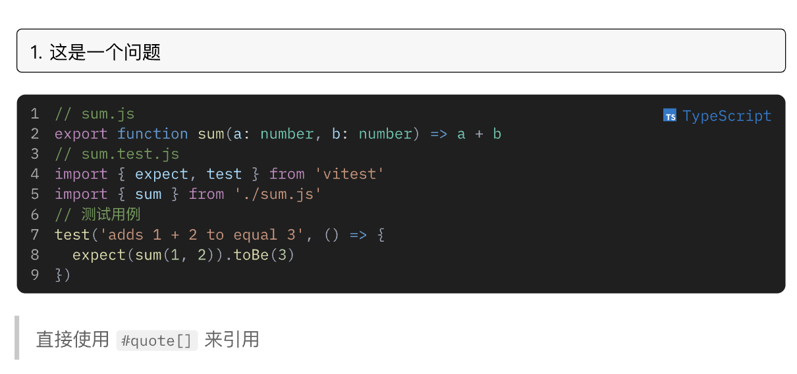

$$
\color{#239DAE}{\text{Typst} \cdot \max_{\text{consensus}}}
$$

<small>通用 Typst 模板，适用于实验报告、课程论文。</small>

# Maximum Consensus 「最大共识」

> ~~最近用 Typst 完成了不少课程作业和论文。有些作业需要特定样式，我就逐一复刻；而没有明确要求的则自己设计，或是复用先前的格式略作修改。最近，我将一些通用的功能和样式整理提取，制作成了一个模板，取名为「最大共识」。~~

由于代码过于凌乱，且一些基于特定课程的特定需求不具有通用型，目前（0.2.x）是在 [Ori](https://github.com/OrangeX4/typst-ori/) 的基础上做了一些自定义修改。因此目前仅用于个人使用，暂时不会发布 Package。

</img>

修改内容如下：

- 根据自身需求删除了一些包的引用。
- 添加了 `cjk-mono` 配置，用于 `raw` 中的中文显示。
- 默认代码块使用 `dark-plus` 主题，支持行号，默认为深色模式。通过 [codly-languages](https://typst.app/universe/package/codly-languages) 显示带颜色的语言和图标。
- 移植自本项目的 `0.1.0`：
  - 从别的项目移植的字体和字号定义，方便需要参考 word 模板设定相关样式。
  - 从别的项目移植，根据自己需求扩展的数学运算符号定义。
  - 使用 `#q[]` 定义一个问题。
- 将原生的 `#qoute[]` 覆盖为 `#qoute-block[]`
